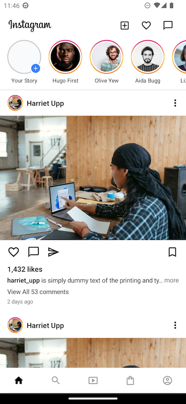

<p align="center">
    <h1 align="center">instagramclone</h1>
    <p align="center">Instagram UI Clone made using Jetpack Compose</p>
</p>
<p align="center" width="100%">
    
    
    
    
</p>

<br>

- Future plan is to make this app functional by using clean Architecture.
- Contributions are highly welcomed :)

## TODO
```
- [ ] Profile Screen
- [ ] Notification Screen
- [ ] Move hardcode data to ViewModel or Repository?
- [ ] Improve better performance for ProfileUserScreen avoid nesting Lazy* (LazyColumn > LazyVerticalGrid)
```